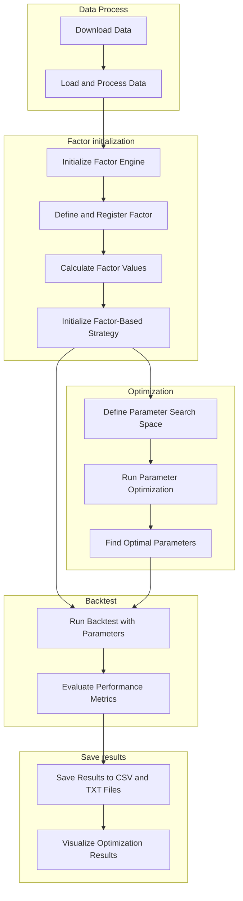
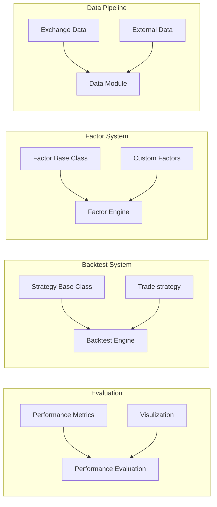
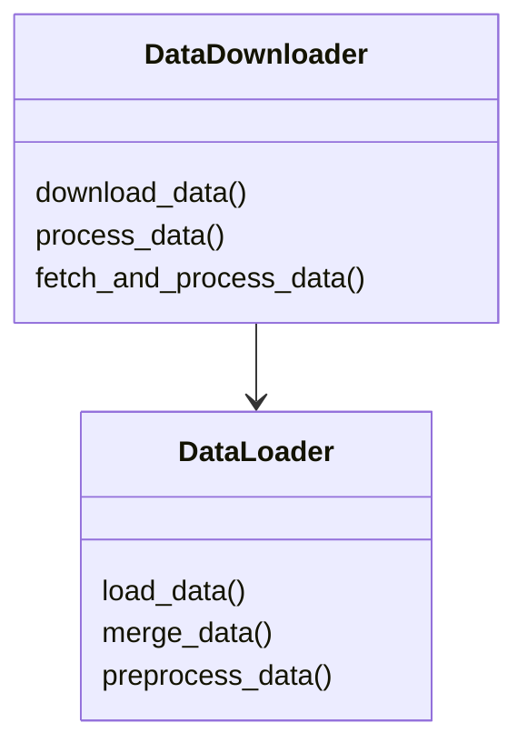
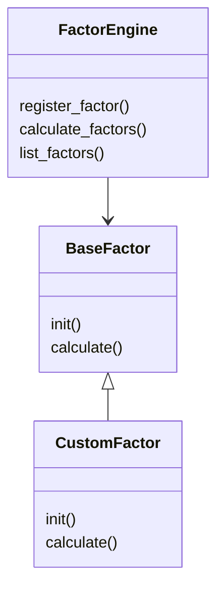
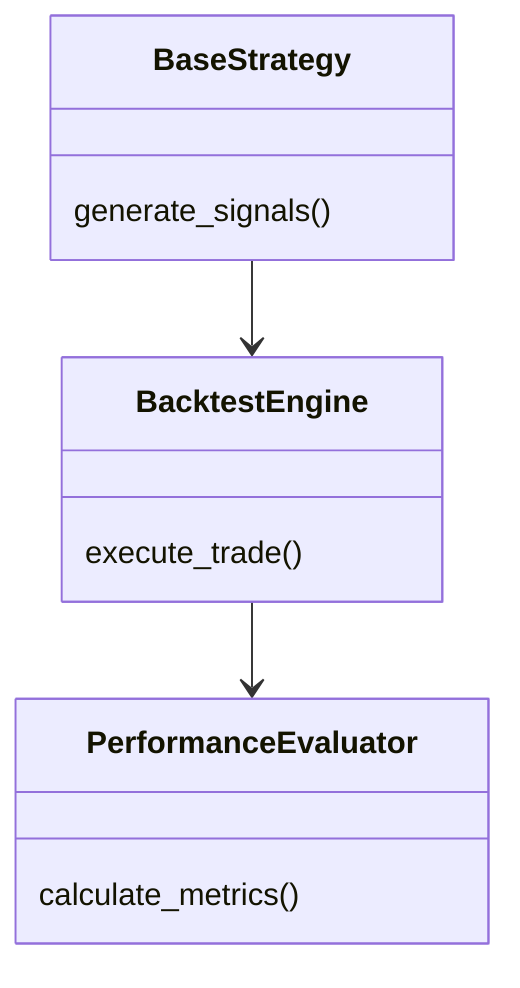

The model should be capable on testing different factors

Enable long/short 

Some key factors should be included in the backtest:

- Sharpe Ratio
- Sortino Ratio
- Annualized return
- Cum. Return
- Max Drawdown
- No. of trades throughout the period

Whenever sharpe Ratio >2.5, we will do further analysis

- Equity curve of the strategy (compare with BTC price chart)
- 3D visualization for visualize potential overfit

## Workflow



## Code module



### **Data Module**



The `DataDownloader` class is designed to download and process cryptocurrency market data from various exchanges. Here's a comprehensive guide on how to use it.

```python
from data.data_downloader import DataDownloader
# Initialize DataDownloader
downloader = DataDownloader(
    symbol="BTCUSDT",          # Trading pair
    interval="1d",             # Time interval
    start_date="2023-01-01",   # Start date
    end_date="2023-12-31",     # End date
    data_folder="./dataset",   # Data storage location
    data_type="spot",          # Market type
    exchange="binance"         # Exchange name
)

# Download and process data
data = downloader.fetch_and_process_data()
```

**Parameters Explanation**

1. **Required Parameters**
    - symbol: Trading pair symbol (e.g., "BTCUSDT", "ETHUSDT")
    - interval: Kline interval (e.g., "1m", "5m", "1h", "1d")
    - start_date: Start date in "YYYY-MM-DD" format
    - end_date: End date in "YYYY-MM-DD" format
    - data_folder: Directory path for data storage
2. **Optional Parameters**
    - data_type: Market type (default: "spot")
        - "spot": Spot market data
        - "futures": Futures market data
    - exchange: Exchange name (default: "binance")

**File Storage Structure**

```kotlin
dataset/
└── binance/
	└── BTCUSDT/
		└── spot/
			└── 1d/
				└── BTCUSDT_1d_2023-01-01_to_2023-12-31.h5
```

### Factor System



**Example**

The provided code defines a **USDT Issuance Factor** as a class named `USDTIssuance2Factor`. This factor is part of a trading strategy framework and is designed to generate trading signals based on the daily issuance of USDT.

The `USDTIssuance2Factor` analyzes the issuance changes of USDT and determines whether to buy, sell, or hold a position based on predefined thresholds:

- **Long Signal (1):** When the issuance exceeds the **upper threshold**.
- **Short Signal (-1):** When the issuance falls below the **lower threshold**.
- **Close Signal (0):** When the issuance is between the two thresholds.


### Backtest System



**Trading strategy**

- **Signal-Based Trading**:
    - The strategy depends on **signals** (buy, sell, or hold) generated by a strategy class.
    - Signals are numeric values:
        - `1`: Long signal.
        - `1`: Short signal.
        - `0`: close position (no action).
- **Trade Execution**:
    No Position:
    - Signal 1: Open long position
    - Signal -1: Open short position
    - Signal 0: No action

    Long Position:
    - Signal 1: No action
    - Signal -1: Switch to short (sell 2x position)
    - Signal 0: Close position

    Short Position:
    - Signal 1: Switch to long (buy 2x position)
    - Signal -1: No action
    - Signal 0: Close position

- Added a slippage parameter, initialized to 0.001. 

    The current logic is as follows:
    -  Open Long Position: Buy at price * (1 + slippage)
    - Open Short Position: Sell at price * (1 - slippage)
    -  Close Long Position: Sell at price * (1 - slippage)
    -  Close Short Position: Buy at price * (1 + slippage)


**Performance Metrics Explanation and Formulas**


1. **Total Return**
    - **Description**: Measures the overall return of the portfolio relative to the initial investment.
    - **Formula**:
        
        $$
        \text{Total Return} = \frac{\text{Final Portfolio Value}}{\text{Initial Investment}} - 1
        $$
        
2.  **Annualized Return**
- **Description**: Adjusts the total return to an annualized rate, taking into account the duration of the investment.
- **Formula**:
    
    $$
    \text{Annualized Return} = \left(1 + \text{Total Return}\right)^{\frac{1}{\text{Years}}} - 1
    $$
    
    $$
    \text{Years} = \frac{\text{End Date} - \text{Start Date}}{365.25}
    $$
    
1.  **Sharpe Ratio**
    - **Description**: Measures the strategy's risk-adjusted return by comparing the excess return (return above the risk-free rate) to its volatility.
    - **Formula:**
    
    $$
    \text{Sharpe Ratio} = \frac{\text{Mean(Excess Daily Returns)}}{\text{Standard Deviation of Daily Returns}} \times \sqrt{365}
    $$
    
    $$
    \text{Excess Daily Returns} = \text{Daily Returns} - \frac{\text{Risk-Free Rate（0.0）}}{365}
    $$
    
2. **Sortino Ratio**
    - **Description**: Similar to the Sharpe Ratio but focuses only on downside risk, which is more relevant for risk-averse investors.
    - **Formula**:
        
        $$
        \text{Sortino Ratio} = \frac{\text{Mean(Excess Daily Returns)}}{\text{Downside Deviation}}   \times \sqrt{365} \\ \text{Excess Daily Returns} = \text{Daily Returns} - \frac{\text{Risk-Free Rate（0.0）}}{365}
        $$
        
    
    $$
    \text{Downside Deviation} = \sqrt{\frac{1}{N} \sum_{i=1}^{N} (\text{Negative Returns})^2}
    $$
    
    > Only negative returns (below the target return(0.0)) are considered.
    > 
    
3.  **Maximum Drawdown**
    - **Description**: Measures the largest peak-to-trough decline in portfolio value, representing the worst potential loss.
    - **Formula:**
    
    $$
    \text{Max Drawdown} = \min(\text{Portfolio Returns} - \text{Running Maximum})
    $$
    
    $$
    \text{Running Maximum} = \max(\text{Cumulative Portfolio Returns})
    $$
    
4. **Number of Trades**
    - **Description**: Counts the total number of trades executed during the backtest.
    - **Formula**:
        
        $$
        \text{Number of Trades} = \text{Count(Position Changes)}
        $$
        
        - Each change in position (buy or sell) is counted as a trade.

1.  **Cumulative Returns**
    - **Description**: Tracks the portfolio's return over time relative to the initial investment.
    - **Formula:**
    
    $$
    \text{Cumulative Return at Time } t = \frac{\text{Portfolio Value at } t}{\text{Initial Investment}}
    $$
    

## Performance Optimization

The system has undergone significant performance optimization, achieving a 23x speed improvement. Here are the key optimization strategies:

### 1. NumPy Array Operations
- **Before**: Frequent Pandas DataFrame operations
- **After**: Using NumPy arrays for calculations
- **Why it's faster**: 
  - Lower-level implementation
  - No index overhead
  - More efficient memory access patterns
  - Direct CPU array operations

### 2. Vectorization
- **Before**: Loop-based calculations and multiple if-else statements
- **After**: Vectorized operations using `np.where` and array operations
- **Why it's faster**:
  - Leverages CPU's SIMD (Single Instruction Multiple Data) capabilities
  - Reduces branch prediction failures
  - Allows parallel processing at CPU level
  - Minimizes Python interpreter overhead

### 3. Memory Management
- **Before**: Frequent DataFrame updates and copies
- **After**: Batch operations on NumPy arrays
- **Why it's faster**:
  - Reduced memory allocations
  - Fewer data copies
  - Better cache utilization
  - Single DataFrame update at the end

### 4. Code Example
```python
# Before Optimization
for i in range(len(data)):
    if portfolio.iloc[i-1]['holdings'] == 0:
        if signals.iloc[i]['signal'] == 1:
            portfolio.iloc[i]['holdings'] = 1
        elif signals.iloc[i]['signal'] == -1:
            portfolio.iloc[i]['holdings'] = -1

# After Optimization
signal_array = signals['signal'].values
holdings_array = portfolio['holdings'].values

holdings_array[i] = np.where(signal_array[i] == 1, 1,
                   np.where(signal_array[i] == -1, -1, 0))
portfolio['holdings'] = holdings_array
```

### 5. Key Improvements
- Trading logic execution: 23x faster
- Memory usage: Significantly reduced
- Code maintainability: Improved through consistent vectorization patterns
- Scalability: Better handling of large datasets

### 6. Best Practices Learned
1. Use NumPy arrays for numerical computations whenever possible
2. Vectorize operations instead of using loops
3. Minimize DataFrame operations and perform them in batch
4. Keep data in contiguous memory blocks
5. Reduce object creation and copying
6. Use appropriate data structures for the task

These optimizations demonstrate how proper vectorization and data structure selection can dramatically improve performance in Python data processing applications.

